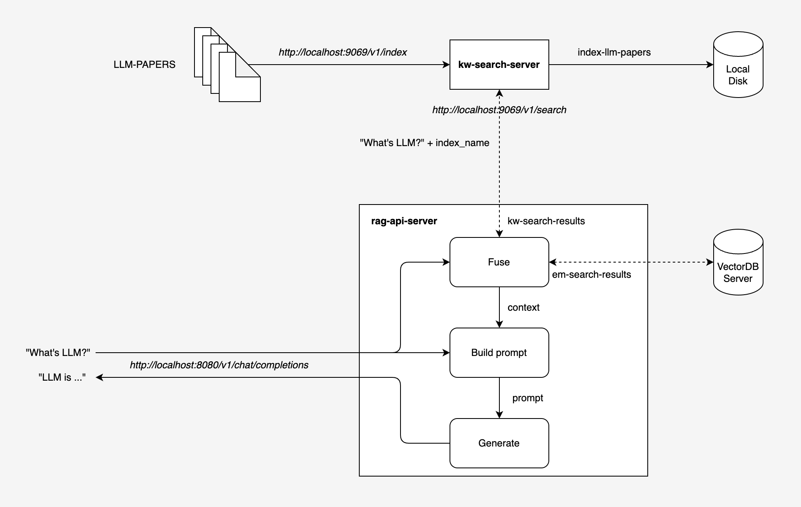

# Keyword Search Server

Keyword search in RAG scenarios is a lightweight and efficient retrieval method. This approach enhances overall performance and improves the quality of generated results. `kw-search-server` is a web server that provides keyword search service. It provides the following features:

- Indexing documents via the `/v1/index/create` endpoint
- Keyword search via the `/v1/search` endpoint
- Download index file via the `/v1/index/download/{index_name}` endpoint

> [!IMPORTANT]
> This project is still in the active development stage.

## Quick Start

- Download `kw-search-server` binary

  ```bash
  export VERSION=0.1.0

  # macOS on Apple Silicon
  curl -LO https://github.com/LlamaEdge/kw-search-server/releases/download/${VERSION}/server-assistant-aarch64-apple-darwin.tar.gz
  tar -xvzf server-assistant-aarch64-apple-darwin.tar.gz

  # macOS on Intel
  curl -LO https://github.com/LlamaEdge/kw-search-server/releases/download/${VERSION}/server-assistant-x86_64-apple-darwin.tar.gz
  tar -xvzf server-assistant-x86_64-apple-darwin.tar.gz

  # Linux
  curl -LO https://github.com/LlamaEdge/kw-search-server/releases/download/${VERSION}/server-assistant-x86_64-unknown-linux-gnu.tar.gz
  tar -xvzf server-assistant-x86_64-unknown-linux-gnu.tar.gz
  ```

- Run `kw-search-server`

  ```bash
  # Run server on default port 9069
  ./kw-search-server

  # Run server on custom port, e.g. 10086
  ./kw-search-server --port 10086

  # Or, run server with custom socket address, e.g. 0.0.0.0:10086
  ./kw-search-server --socket-addr 0.0.0.0:10086
  ```

  To see all CLI options:

  ```bash
  ./kw-search-server --help

  Usage: kw-search-server [OPTIONS]

  Options:
        --download-url-prefix <DOWNLOAD_URL_PREFIX>
            Download URL prefix, format: `http(s)://{IPv4_address}:{port}` or `http(s)://{domain}:{port}`
        --socket-addr <SOCKET_ADDR>
            Socket address of llama-proxy-server instance. For example, `0.0.0.0:9069`
        --port <PORT>
            Socket address of llama-proxy-server instance [default: 9069]
    -h, --help
            Print help
    -V, --version
            Print version
  ```

## Usage: indexing and keyword search

### Create index

To create an index for a list of documents, you can use the `/v1/index/create` endpoint.

- Index for a list of documents

  ```bash
  # Create index from a list of files
  curl --location 'http://localhost:9069/v1/index/create' \
  --form 'file1=@"paris.txt"' \
  --form 'file2=@"paris.md"'
  ```

  If the index is created successfully, the response body in JSON format is as follows:

  ```json
  {
      "results": [
          {
              "filename": "paris.txt",
              "status": "indexed",
              "error": null
          },
          {
              "filename": "paris.md",
              "status": "indexed",
              "error": null
          }
      ],
      "index_name": "index-4aae1cf6-d8dc-4233-b2bb-43911f9b74fd",
      "download_url": "http://localhost:9069/v1/index/download/index-4aae1cf6-d8dc-4233-b2bb-43911f9b74fd"
  }
  ```

  **Note** that the files should be of `txt` or `md` format.

- Index for a list of chunks

  ```bash
  # Create index from a list of chunks
  curl --location 'http://localhost:9069/v1/index/create' \
  --header 'Content-Type: application/json' \
  --data '{
      "documents": [
          {
              "content": "Paris, city and capital of France, ..."
              "title": "section 1" # optional
          },
          {
              "content": "Paris occupies a central position ..."
              "title": "section 2" # optional
          },
          {
              "content": "For centuries Paris has been one ..."
              "title": "section 3" # optional
          },
          {
              "content": "Paris’s site at a crossroads ..."
              "title": "section 4" # optional
          }
      ]
  }'
  ```

  If the index is created successfully, the response body in JSON format is as follows:

  ```json
  {
      "results": [
          {
              "filename": "section 1",
              "status": "indexed",
              "error": null
          },
          {
              "filename": "section 2",
              "status": "indexed",
              "error": null
          },
          {
              "filename": "section 3",
              "status": "indexed",
              "error": null
          },
          {
              "filename": "section 4",
              "status": "indexed",
              "error": null
          }
      ],
      "index_name": "index-a1f79ad1-b47b-4e36-948e-a591646ca014",
      "download_url": "http://localhost:9069/v1/index/download/index-a1f79ad1-b47b-4e36-948e-a591646ca014"
  }
  ```

### Perform keyword search

To perform a keyword search, you can use the `/v1/search` endpoint:

```bash
curl --location 'http://localhost:9069/v1/search' \
--header 'Content-Type: application/json' \
--data '{
    "query": "What is the location of Paris, France along the Seine river?",
    "top_k": 5,
    "index": "index-a1f79ad1-b47b-4e36-948e-a591646ca014"
}'
```

If the search is successful, the response body in JSON format is as follows:

```json
{
    "hits": [
        {
            "title": "section 1",
            "content": "Paris, city and capital of France, situated in the north-central part of the country. People were living on the site of the present-day city, located along the Seine River some 233 miles (375 km) upstream from the river’s mouth on the English Channel (La Manche), by about 7600 BCE. The modern city has spread from the island (the Île de la Cité) and far beyond both banks of the Seine.",
            "score": 5.5615416
        },
        {
            "title": "section 2",
            "content": "Paris occupies a central position in the rich agricultural region known as the Paris Basin, and it constitutes one of eight départements of the Île-de-France administrative region. It is by far the country’s most important centre of commerce and culture. Area city, 41 square miles (105 square km); metropolitan area, 890 square miles (2,300 square km).",
            "score": 1.0718238
        },
        {
            "title": "section 3",
            "content": "Paris’s site at a crossroads of both water and land routes significant not only to France but also to Europe has had a continuing influence on its growth. Under Roman administration, in the 1st century BCE, the original site on the Île de la Cité was designated the capital of the Parisii tribe and territory. The Frankish king Clovis I had taken Paris from the Gauls by 494 CE and later made his capital there.",
            "score": 1.0254539
        },
        {
            "title": "section 4",
            "content": "For centuries Paris has been one of the world’s most important and attractive cities. It is appreciated for the opportunities it offers for business and commerce, for study, for culture, and for entertainment; its gastronomy, haute couture, painting, literature, and intellectual community especially enjoy an enviable reputation. Its sobriquet “the City of Light” (“la Ville Lumière”), earned during the Enlightenment, remains appropriate, for Paris has retained its importance as a centre for education and intellectual pursuits.",
            "score": 0.6374644
        }
    ]
}
```

## Integration with LlamaEdge-RAG

The following diagram shows the integration of `kw-search-server` with LlamaEdge-RAG.

<div align=center>

</div>
